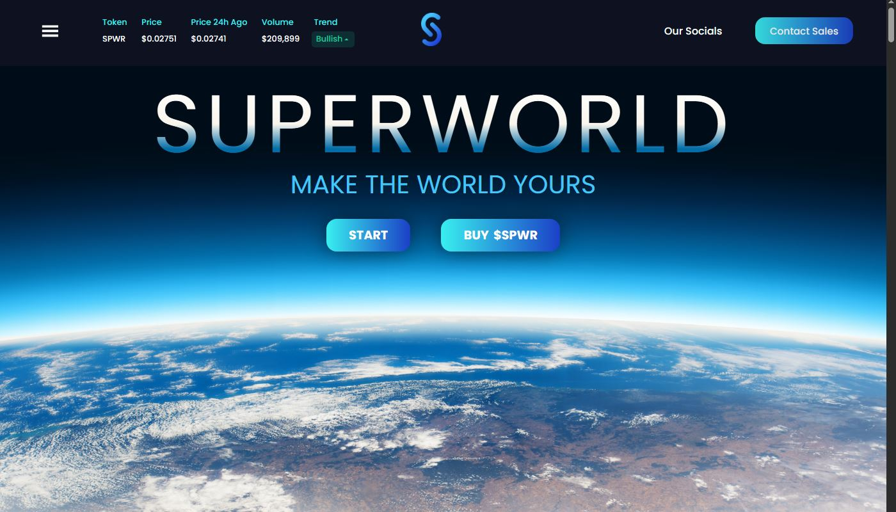
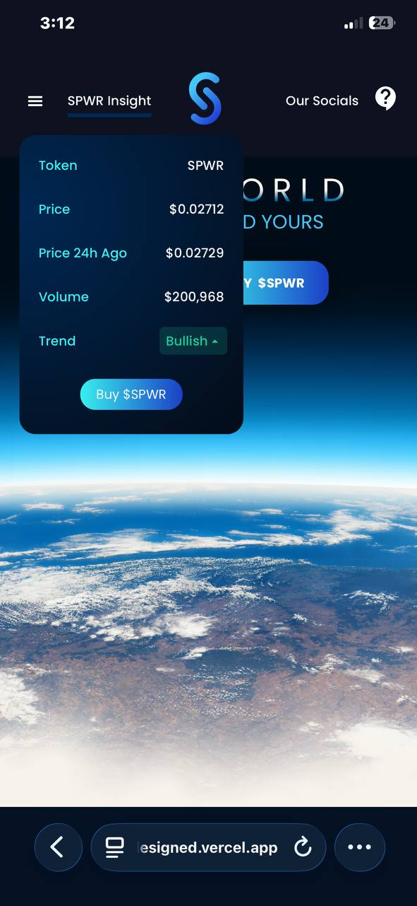
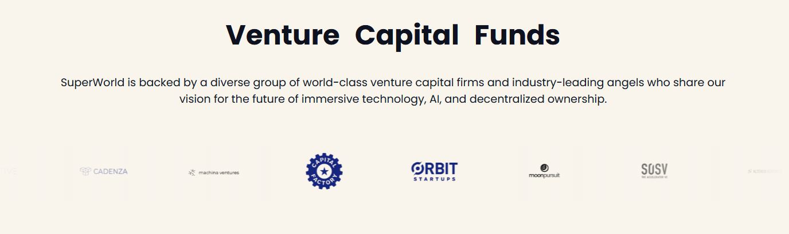
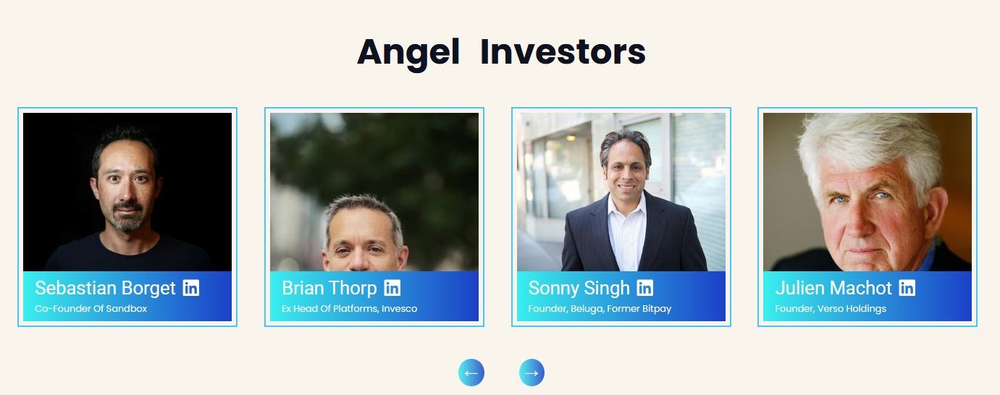
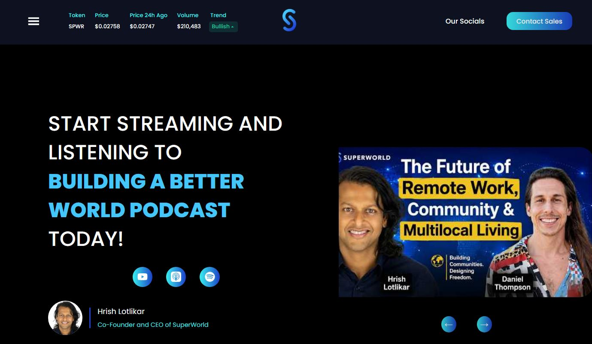
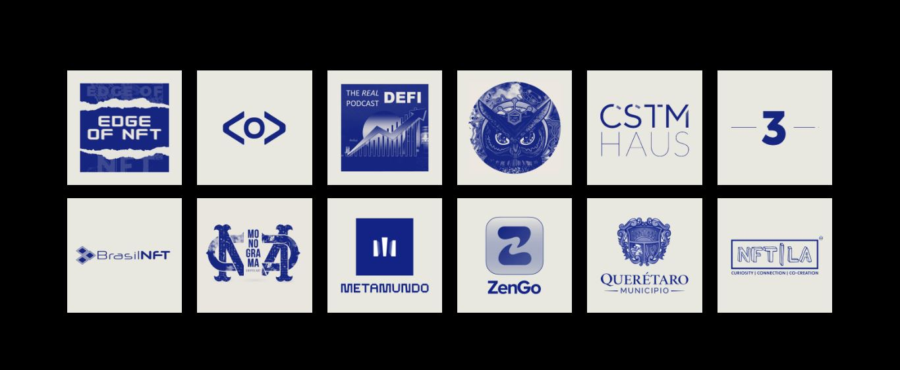

# SuperWorld Homepage
This project's main purpose is to redesign the SuperWorld homepage.
SuperWorld is a breakout Web3 company where any individual could buy and own virtual real estate.
You purchase a plot in locations you love which makes you a virtual property owner, and when other 
users interacts with contents in your locations, you monetize.
You could also earn when events happen in locations you own.

# What's New?

* ## $SPWR Token Insight
  The $SPWR Token real time data has been added to the navigation bar. Users on the platform can now 
  see the token's insight right on the app. No need to look up the price on third party platforms.
  The data updates every 5 seconds making it possible to provide accurate data and keep track of
  the trend.

  ### Web view

  

  ### Mobile view

  

* ## Venture Capital Funds Logo Slide
  The logos of the VC's that backed SuperWorld are being animated to slide from right to left while fading in and out. 

  
  

* ## Angel Investor Profile
  Angel Investors of SuperWorld are being rendered on the page with their photo,name,company or profession.
  Users could click on the LinkedIn icon and visit their profiles.

  ### SuperWorld Investors
  

* ## Building a Better World Podcast
  SuperWorld has a podcast programme hosted by Co-founder and CEO Hrish Lotlikar. Topics mostly discussed are AI,Web3,Remote Working,Nomading and among others. This project has a section where a user can get to know the most latest topics discussed. Users could listen or watch any of these podcasts on their preffered platform.
  A user could hover on any of the trending podcast and click to listen to that particular podcast.

  ### Podcasts
  

* ## Discovery
  This project changes the functionality of the discovery section. The section is now being auto rendered
  every 5 seconds. Switching between 24 logos,12 per each render.

  

# IMPORTANT
  This project is inspired by the original design. I only redesigned it because I have some ideas which I believe
  could improve what has been designed already. And also for the fun that comes with it.

My working SuperWorld homepage: https://superworld-homepage-redesigned.vercel.app/

Official SuperWorld homepage: https://www.superworldapp.com/

Made with ❤